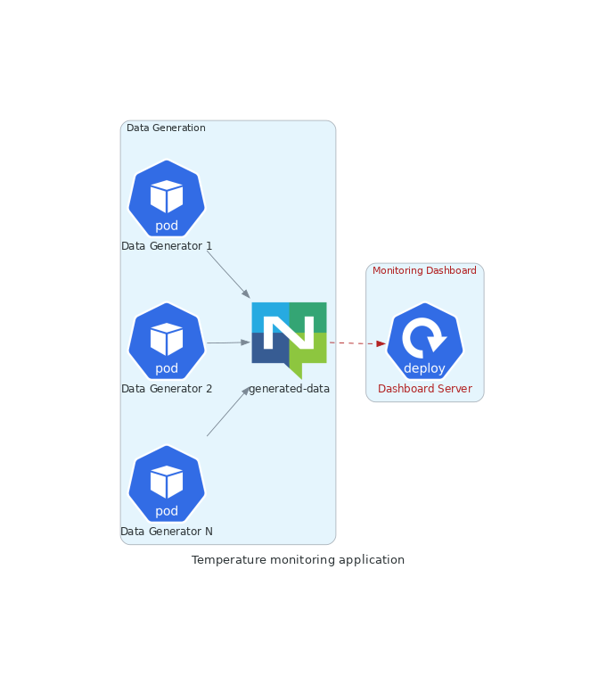

## tma-deployment-configurations

Deployment configurations for the Temperature Monitoring Applicaiton.

The Temperature Monitoring Application is an educational Kafka app, used as a playground for learning Go and exploring common streaming/microservice topics.

## Application diagram

## Services

### Data generator

Since this is mainly a playground, the downstream services are fed by a data generating service. It produces random values for temperature, humidity and atmospheric pressure, which are then processed by other services.

The repository can be found [here](https://github.com/ivanov-slk/tma-data-generator).
